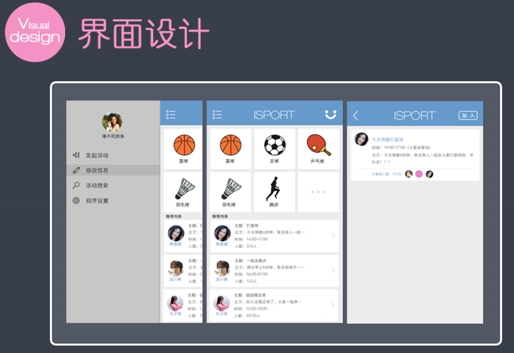
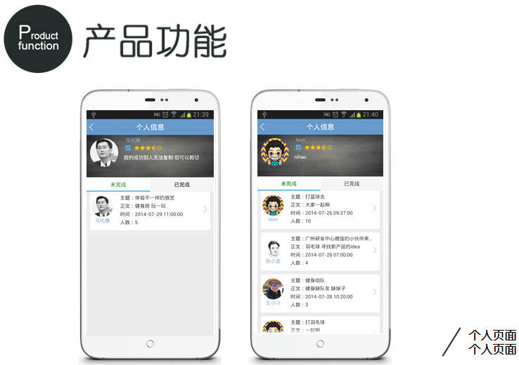
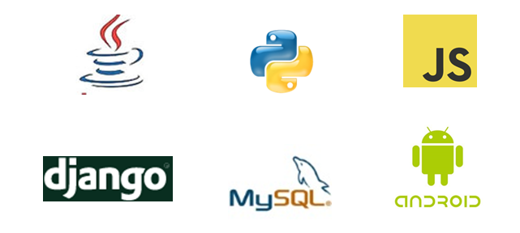

iSport
======

Images
------

Introduction
------------

This is a demo project (which means the code of this project can be very bad and silly) which used on a programming hackson about 12 days. This project shows how fast our team can be to deal with an unknown problem.

这是一个示例的项目（这也就意味着项目的代码会比较烂），这个项目是用在一个为期12天的编程马拉松比赛里面用的。代码展示了我们团队如何在短时间之内处理不明真相的问题。

Main features
-------------

* Support O2O SNS on sport interest and join in the same activity
* 支持在相同的运动活动上的O2O运动社交
* Support simple sports recommendation
* 支持简单的活动推荐
* Support sport data search and filter different kinds of sport
* 支持对活动搜索和过滤
* Support submit your own sport item with map location data
* 支持自己发布自己想要做的活动 号召别人加入一起参与
* Other SNS features and so on
* 其他的一些社交的功能

Dependency
----------

Client

    Android SDK 2.3+
    Gaode Map SDK
    UITableView
    Gson

Server

    Django
    Mysql

Thanks To
---------

